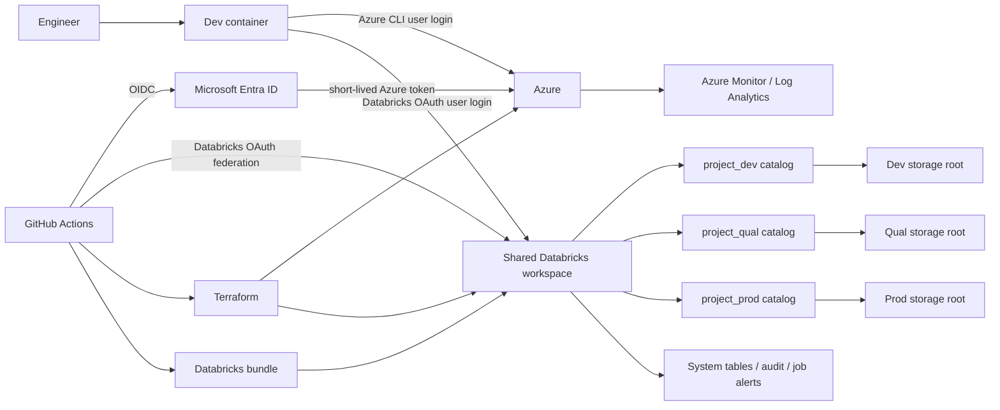

# Azure Databricks reference platform with Terraform

> **Status:** bootstrap and minimal serverless Azure Databricks platform deployed; Unity Catalog governance and application deployment are next.
>
> **Last reviewed:** 2026-08-01. Recheck the linked official documentation before implementation or upgrades.

This repository will be a practical, end-to-end reference for building and operating an Azure Databricks platform. It covers the developer environment, Microsoft Entra ID, Azure foundations, Terraform, Unity Catalog, Python wheel packaging, Databricks bundle deployment, GitHub Actions, testing, security, cost, monitoring, recovery, and promotion through `dev`, `qual`, and `prod`.

The first version intentionally uses **one Azure Databricks workspace and its serverless default-storage catalog**. Terraform manages the development schemas and grants inside that catalog without adding customer-managed ADLS. Future `qual` and `prod` environments should use protected catalogs or separate workspaces when stronger isolation is required.

## Target outcome

When complete, this repository should provide:

- A reproducible, non-root dev container with pinned tools.
- Terraform-managed Azure and Databricks foundations.
- Passwordless CI/CD using OIDC/workload identity federation.
- Separate `<project>_dev`, `<project>_qual`, and `<project>_prod` catalogs.
- A tested Python package built as an immutable wheel.
- Jobs deployed using Declarative Automation Bundles, formerly Databricks Asset Bundles.
- Pull-request checks and protected environment promotion in GitHub Actions.
- Least-privilege identities, auditability, monitoring, budgets, and runbooks.
- Enough context for a newcomer to understand why the platform is designed this way.

## Principles

1. Infrastructure, permissions, and deployment configuration live in code.
2. Prefer short-lived identity over PATs, passwords, client secrets, storage keys, or SAS tokens.
3. Build once, record the digest, and promote the same wheel through every environment.
4. Environment configuration changes; application source code does not.
5. Human, infrastructure deployer, bundle deployer, runtime, and storage identities remain separate.
6. `qual` and `prod` changes require protected GitHub environments and an audit trail.
7. Security, cost, observability, recovery, and documentation are part of delivery.

## Architecture



Azure OIDC and Databricks OIDC are **separate trust configurations**. A successful `azure/login` does not automatically authorize Databricks API calls.

## Ownership boundaries

A resource must have one authoritative owner. Never manage the same Databricks job in both Terraform and a bundle, or the same grant in Terraform and by hand.

| Layer | Owns |
| --- | --- |
| Bootstrap | Remote-state storage and the minimum RBAC needed to operate it |
| Terraform | Azure resources, networking, identities, role assignments, Databricks account/workspace foundations, Unity Catalog containers, and grants |
| Python package | Tested business logic and console entry points |
| Databricks bundle | Wheels, jobs, pipelines, job ACLs, and target-specific workload configuration |
| GitHub Actions | Checks, plans, artifact provenance, approvals, deployment, and promotion |
| Operators | Approval, incident response, break-glass work, and reconciliation back to code |

## Current status

| Capability | Status |
| --- | --- |
| Architecture and roadmap | Documented here |
| Dev container | Initial scaffold committed; pinning and build tests planned |
| Resource-group Terraform module | Implemented; four mocked tests pass without an Azure subscription |
| Terraform backend | Implemented with Entra authentication, versioning, soft delete, container-scoped RBAC, and a deletion lock |
| Azure platform | Deployed in `centralindia`; resource group and $10/month subscription budget managed by Terraform |
| Databricks workspace | Deployed as Premium `Serverless`; no managed resource group or customer-managed networking |
| Unity Catalog governance | Implemented for dev schemas and runtime grants in `dbw_azref_sandbox_centralindia_001` |
| Python wheel and bundle | Implemented; deployment awaits governance identities and catalog grants |
| GitHub Actions | CI implemented; manual OIDC deployment scaffold added |
| Monitoring and runbooks | Planned |

## Azure essentials

### Resource hierarchy

```text
Microsoft Entra tenant
└── Management groups
    └── Subscriptions
        └── Resource groups
            └── Resources
```

- The **Entra tenant** is the identity boundary for users, groups, applications, and service principals.
- **Management groups** organize subscriptions and apply policy/RBAC at scale.
- A **subscription** is a billing, quota, policy, access, and blast-radius boundary. Mature production should normally have its own subscription.
- A **resource group** is a lifecycle container. Group resources that are deployed, operated, and retired together.
- **Azure RBAC** controls who may act; **Azure Policy** constrains what may be deployed.

Always verify the active context before cloud work:

```bash
az account show --output table
```

### Authentication and authorization layers

| Layer | Purpose |
| --- | --- |
| Authentication | Entra ID or Databricks OAuth proves the actor's identity |
| Azure RBAC | Controls Azure management-plane and supported data-plane actions |
| Azure Policy | Enforces governance constraints on resource configuration |
| Databricks ACLs | Control workspace objects such as jobs and compute |
| Unity Catalog privileges | Control catalogs, schemas, tables, volumes, functions, and models |

Azure `Contributor` does not automatically read blob data or Unity Catalog data. A Unity Catalog owner does not automatically manage the Azure workspace resource. Design and test every layer independently.

### Identity model

| Actor | Azure authentication | Databricks authentication |
| --- | --- | --- |
| Local engineer | Interactive `az login`, MFA, correct tenant/subscription | OAuth user login or supported Azure CLI authentication |
| Terraform CI | GitHub OIDC to a narrowly scoped Entra service principal or user-assigned managed identity | Databricks OAuth federation when the stack manages Databricks objects |
| Bundle CI | Azure identity only if Azure access is required | One OIDC-federated Databricks deployer per environment |
| Databricks job | No human credential | Stable `run_as` service principal with task-specific data grants |
| Unity Catalog storage | Databricks Access Connector managed identity | Unity Catalog storage credential/external-location privileges |

Use groups for human access. Use separate `dev`, `qual`, and `prod` automation identities and exact federation subjects. A development workflow must not impersonate production.

Important terms:

- An **app registration/application object** defines an application.
- A **service principal** is that application's tenant-local identity.
- A **managed identity** is an Azure-managed service principal without a developer-managed credential.
- **Workload identity federation** exchanges an external OIDC token for a short-lived token without a client secret.
- **PIM** provides just-in-time activation for privileged human roles.

### Decisions required before implementation

| Decision | Initial direction | Value |
| --- | --- | --- |
| Tenant | Existing organization tenant | `bbc40903-74f4-495f-9185-08f2bf5b64be` |
| Subscriptions | Sandbox initially; separate production later | `sub-azdbx-sandbox-001` |
| Region | Keep workspace, metastore, and storage region-compatible | `centralindia` |
| Naming prefix | Short and stable | `<org>-<project>` |
| Tags | application, environment, owner, cost center, managed by, data classification | `<values>` |
| Network | Serverless-first public-hardened design; no customer-managed NAT Gateway or static egress IP initially | Accepted |
| Recovery | Define RTO, RPO, backup, and regional expectations | `<targets>` |
| Budget | Monthly budget with actual-spend alerts at 50%, 80%, and 100% | `10` in the subscription billing currency |
| Shared workspace exit | Compliance, scale, data sensitivity, or blast-radius trigger | `<trigger>` |

### Bootstrap boundary

This repository assumes that the Microsoft Entra tenant and the first Azure subscription already exist before Terraform is applied. Prefer an existing organization tenant; create a new tenant only for an intentionally isolated lab or when no suitable tenant exists. Create or select the initial sandbox subscription through the organization billing and administration process, associate it with the chosen tenant, and verify the operator has the required ownership.

Automating tenant creation, billing-account setup, or the first subscription is outside this repository scope. A future organization-level subscription-factory stack may automate additional subscriptions when the required billing scope and permissions exist. This repository starts Terraform ownership at the bootstrap resource group, remote-state storage, state container, and minimum RBAC. Existing resources must be imported instead of recreated.

Tenant IDs and subscription IDs are identifiers, not credentials, but passwords, tokens, client secrets, storage keys, and local authentication files must never be committed.

### Expected Azure resources

- A bootstrap resource group, Storage account, and private blob container for Terraform state.
- An Azure Databricks workspace with Unity Catalog enabled.
- A Databricks Access Connector with a managed identity.
- ADLS Gen2 storage with distinct roots for `dev`, `qual`, and `prod`.
- An Azure Key Vault per application/environment for exceptional secrets.
- Log Analytics, diagnostic settings, alerts, and retention.
- Azure budgets and cost alerts.
- A serverless-first Azure Databricks workspace without a customer-managed NAT Gateway or static egress IP in the initial sandbox.
- VNet injection, NAT Gateway, stable egress IPs, Private Link, Azure Firewall, private endpoints, and Private DNS remain optional future hardening.

Do not add private networking mechanically. It changes DNS, runner placement, developer access, package downloads, and troubleshooting. New VNets created after 2026-03-31 require an explicit outbound method; plan NAT Gateway, Azure Firewall, or another supported route.

### Operational cautions

- Azure Policy, resource-provider registration, regional SKU availability, and quota can block a valid plan.
- Entra role/group propagation is eventually consistent; verify assignments instead of adding arbitrary sleeps.
- Resource locks can also block legitimate Terraform changes.
- State and saved plans may contain secrets even when outputs are marked sensitive.
- Private endpoints require correct DNS and network-connected CI runners.
- Storage, compute, NAT/public IPs, egress, and log ingestion all affect cost.

## Dev container

The committed dev container will provide the same core toolchain locally and in CI:

- Non-root, pinned Linux base.
- Python and `uv`.
- Terraform CLI plus committed provider lock files.
- Azure CLI.
- Databricks CLI `1.10.0`, current at this README's review date, pinned identically in development and CI.
- Git, GitHub CLI, pre-commit, jq, and shell utilities.
- Ruff, pytest, a type checker, markdownlint, yamllint, ShellCheck, actionlint, TFLint, and a Terraform security scanner.
- Python, Terraform, YAML, Databricks, and container editor extensions.

Planned files:

```text
.devcontainer/
├── devcontainer.json
├── Dockerfile
└── scripts/
    └── post-create.sh
```

Pin the base image and Dev Container Features, commit the generated lock file, and build-test it with a frozen lock. The post-create step may install locked dependencies and hooks, but must not authenticate or provision. Never bake `.azure`, `.databrickscfg`, SSH keys, `.env`, Terraform state, or tokens into the image. Exposing the Docker socket grants host-level power and should be avoided unless required.

Local verification:

```bash
az login --tenant <tenant-id>
az account set --subscription <subscription-id>
az account show --output table

databricks auth login --host https://<workspace-url>
databricks auth describe --host https://<workspace-url>

terraform version
databricks version
uv --version
```

## Terraform design

Terraform owns long-lived Azure and Databricks foundations. Bundles own application jobs and releases.

For a detailed explanation of the deployed Terraform architecture, Azure-side resources, remote state, providers, dependency graph, cost boundary, and command lifecycle, see [Terraform and Azure architecture](docs/terraform-azure-architecture.md).

### Resource-group module (implemented)

The first reusable child module creates one Azure resource group and standardizes the baseline tags. It is intentionally small so the repository can establish module structure, validation, testing, provider locking, and examples before an Azure subscription is available.

The module:

- Validates Azure resource-group length and naming rules with a deliberately strict ASCII character set.
- Requires non-empty application, environment, owner, cost-center, and data-classification tags.
- Adds `managed_by = "terraform"`.
- Supports up to 44 additional tags while protecting the six standard tag keys.
- Exposes the resource-group ID, name, location, and final tags.
- Does not contain a provider configuration; the calling root module owns authentication and provider settings.

Example use:

```hcl
module "resource_group" {
  source = "../../modules/resource-group"

  name     = "rg-azref-dev-uksouth-001"
  location = "uksouth"
  required_tags = {
    application         = "azref"
    environment         = "dev"
    owner               = "platform-team"
    cost_center         = "learning"
    data_classification = "internal"
  }
  additional_tags = {
    purpose = "terraform-module-example"
  }
}
```

Run its credential-free tests from the repository root:

```bash
terraform -chdir=infrastructure/modules/resource-group init -backend=false
terraform -chdir=infrastructure/modules/resource-group validate
terraform -chdir=infrastructure/modules/resource-group test
```

The tests use Terraform's mocked AzureRM provider, so they load the real provider schema but never call Azure or create billable infrastructure. Four tests currently cover the successful resource/tag contract and rejection of an invalid name, unsupported environment, and reserved tag override.

The reusable module declares its minimum supported AzureRM constraint; its committed lock file records the provider version used by the current mocked tests. The live bootstrap root pins AzureRM `5.x` and commits its own provider lock file.

### Remote state

Use the `azurerm` backend with Entra data-plane authentication. Local work uses Azure CLI authentication; CI uses OIDC with `use_oidc = true` and `use_azuread_auth = true`.

The bootstrap stack creates the backend and minimum RBAC, then migrates its local state to the protected backend. The sandbox implementation uses one Standard LRS storage account in `centralindia`; it has no compute or fixed networking resources and costs less than one cent per month at the current state size. Recovery from a previous blob version still needs to be exercised and documented.

Implemented bootstrap path: `rg-azref-bootstrap-centralindia-001` → `stazreftfstate5f78` → `tfstate` → `bootstrap/terraform.tfstate`. New checkouts initialize it with Azure CLI authentication and `use_azuread_auth=true`; no account key or backend secret is committed.

Planned state keys:

```text
bootstrap/terraform.tfstate
platform/terraform.tfstate
governance/shared/terraform.tfstate
governance/dev/terraform.tfstate
governance/qual/terraform.tfstate
governance/prod/terraform.tfstate
```

The shared state owns genuinely shared account/metastore objects; each catalog state owns its storage root, catalog, schemas, and grants. Split by ownership and blast radius. Do not use Terraform CLI workspaces where credentials or access controls differ.

Backend controls:

- Grant `Storage Blob Data Contributor` at container scope where possible.
- Disable anonymous/shared-key access where the design supports it.
- Enable blob versioning, blob/container soft delete, retention, diagnostics, and a deletion lock.
- Never commit state, backups, `.terraform/`, plans, crash logs, or backend credentials.
- Treat plans as sensitive, short-retention artifacts.
- A private-only state endpoint needs a network-connected runner.

### Quality gates

```bash
terraform fmt -check -diff -recursive
terraform init -backend=false -input=false
terraform validate -no-color
terraform test
tflint --recursive
```

Also run policy/security scanning and an authenticated plan on trusted code. Pin Terraform/provider/module versions and commit `.terraform.lock.hcl`. Use typed, documented, validated module inputs and stable `for_each` keys. Import existing resources; do not recreate them merely because they began outside Terraform.

## Azure Databricks and Unity Catalog

### Object hierarchy

```text
Azure Databricks account
└── Unity Catalog metastore (regional)
    ├── workspace
    ├── catalog
    │   └── schema
    │       ├── table/view
    │       ├── volume
    │       ├── function
    │       └── model
    ├── storage credential
    └── external location
```

Unity Catalog does not replace Azure RBAC or workspace ACLs.

### Initial environment model

| Target | Catalog | Schema strategy | Deployment |
| --- | --- | --- | --- |
| `dev` | `<project>_dev` | Personal developer schemas plus shared integration schema | Personal/local deploys and shared deployment from `main` |
| `qual` | `<project>_qual` | Stable application schema | Same release after dev tests; approval; schedules initially paused |
| `prod` | `<project>_prod` | Stable application schema | Protected approval, release record, and smoke test |

Each catalog needs a separate managed storage root or external-location path, stable ownership, and explicit grants. Never point catalogs at the same table path. Fully qualify objects as `catalog.schema.object` rather than relying on the workspace default catalog.

Schemas such as landing/bronze/silver/gold should exist only if the data design needs them.

### Shared-workspace limitation

Three catalogs in one workspace are **not three isolated environments**:

- Workspace admins, control plane, network paths, quotas, and workspace configuration remain shared.
- Workspace-catalog bindings isolate catalogs between workspaces; they cannot separate three catalogs inside one workspace.
- An over-privileged identity or compute resource increases cross-environment blast radius.
- Production and interactive development share a control plane.

Mitigate initially with separate deployer and runtime identities, explicit grants, dedicated compute policies, separate storage roots and bundle paths, no developer production writes, and protected deployments. Move production to a separate subscription/workspace when security, compliance, scale, availability, or blast-radius requirements demand it.

### Permissions

Planned groups/identities:

```text
<project>-developers
<project>-qual-testers
<project>-prod-readers
<project>-prod-operators
<project>-platform-admins
<project>-deploy-dev
<project>-deploy-qual
<project>-deploy-prod
```

Rules:

- Grant humans through groups and make groups/service principals—not employees—the owners.
- Developers modify only development data and namespaced workspace paths.
- Production readers receive only `USE CATALOG`, `USE SCHEMA`, and required reads.
- Operators run/manage approved jobs without becoming workspace/metastore admins.
- Each deployer manages only its target and may use its runtime principal without inheriting that principal's data access.
- Runtime identities receive task-specific `SELECT`, `MODIFY`, `CREATE TABLE`, or equivalent privileges.
- Avoid broad admin and `ALL PRIVILEGES` shortcuts.
- Review membership, ownership, and effective grants regularly.

Bundle `permissions` controls workspace resource ACLs; Unity Catalog grants are separate. Use an Access Connector, storage credential, and external locations for ADLS. Avoid legacy DBFS mounts and DBFS-root wheel storage.

## Python wheel and Databricks bundle

Databricks Asset Bundles are now named **Declarative Automation Bundles (DABs)**. The CLI commands remain `databricks bundle ...`. Do not use the legacy Databricks Labs `dbx` tool for this new project.

### Python package

Use a standard `src` layout, `pyproject.toml`, locked dependencies, and a `[project.scripts]` console entry point:

```text
src/azure_dbx_reference/
├── __init__.py
├── main.py
└── transforms.py
tests/
├── unit/
└── integration/
```

Keep transformations as ordinary testable functions. Put Spark/session creation, widgets, I/O, and job parameters at a thin boundary.

```bash
uv sync --locked
uv run ruff format --check .
uv run ruff check .
uv run pytest
uv build --wheel
```

### Bundle blueprint

```yaml
bundle:
  name: azure-dbx-reference
  databricks_cli_version: "1.10.*"
  engine: direct

include:
  - resources/*.yml

artifacts:
  wheel:
    type: whl
    build: uv build --wheel

variables:
  catalog:
    description: Target Unity Catalog catalog
  schema:
    description: Target Unity Catalog schema

workspace:
  host: https://<shared-workspace-url>

targets:
  dev:
    default: true
    mode: development
    presets:
      artifacts_dynamic_version: true
    variables:
      catalog: <project>_dev
      schema: <current-user-short-name>

  qual:
    mode: production
    git:
      branch: main
    presets:
      name_prefix: "[qual] "
      trigger_pause_status: PAUSED
    variables:
      catalog: <project>_qual
      schema: app
    run_as:
      service_principal_name: <qual-runtime-application-id>

  prod:
    mode: production
    git:
      branch: main
    presets:
      name_prefix: "[prod] "
    variables:
      catalog: <project>_prod
      schema: app
    run_as:
      service_principal_name: <prod-runtime-application-id>
```

This is a design sketch, not a ready-to-run file. Add target-specific root paths, job permissions, approved compute/serverless settings, tags, timeouts, notifications, and policy requirements. `mode` accepts `development` or `production`, so `qual` uses production mode with paused schedules.

The current GA direct deployment engine is separate from the Terraform used for Azure infrastructure. Pin the exact CLI version in the dev container and CI.

A serverless wheel job will resemble:

```yaml
resources:
  jobs:
    wheel_job:
      name: wheel-job
      parameters:
        - name: catalog
          default: <catalog-variable>
        - name: schema
          default: <schema-variable>
      tasks:
        - task_key: run_wheel
          python_wheel_task:
            package_name: azure_dbx_reference
            entry_point: main
            parameters:
              - --catalog
              - <catalog-variable>
              - --schema
              - <schema-variable>
          environment_key: default
      environments:
        - environment_key: default
          spec:
            environment_version: "4"
            dependencies:
              - ../dist/*.whl
```

Use dynamic versions only for personal development. `qual`/`prod` use an immutable SemVer/Git-derived wheel version so serverless cannot reuse a cached same-version wheel.

### Commands

```bash
databricks bundle validate --target dev
databricks bundle deploy --target dev
databricks bundle run --target dev wheel_job
databricks bundle summary --target dev
databricks bundle plan --target prod
```

Before deployment, inspect the identity, host, target, catalog, and schema. Only personal/dev deployment is allowed locally. Bundle redeployment can restore job configuration, but it does not undo data mutations; data/schema changes must be compatible and recoverable.

## GitHub Actions

### Repository controls

- Protect `main` with PRs, reviews, resolved conversations, and required checks.
- Add `CODEOWNERS` for infrastructure, identity, workflow, dev-container, and production changes.
- Block direct/force pushes.
- Enable secret scanning/push protection, dependency review, and Dependabot where supported.
- Pin actions to full commit SHAs and let Dependabot propose updates.
- Default `GITHUB_TOKEN` to read-only; grant narrow job-level permissions.
- Never give credentials to fork PRs or execute contributor code through `pull_request_target`.
- Use `dev`, `qual`, and `prod` GitHub environments with branch restrictions and required reviewers.
- Serialize Terraform and bundle deployments with per-target `concurrency`.

### Pull-request checks

PR workflows do not mutate shared cloud resources. They run:

1. Markdown, YAML, JSON, shell, and Actions linting.
2. Python formatting, linting, types, unit tests, coverage, and wheel build.
3. Dependency and secret scanning.
4. Terraform format, backend-free init, validation, TFLint, and security/policy checks.
5. Bundle validation for all targets.
6. A real Terraform plan only for trusted changes, summarized without leaking sensitive values.

### Promotion

```text
pull request
  └── checks + tests + plan + bundle validation
       └── merge to main
            └── build wheel once + record SHA-256/provenance
                 └── deploy dev + smoke/integration tests
                      └── approve qual
                           └── deploy same digest + qualification tests
                                └── approve release
                                     └── deploy same digest to prod
                                          └── smoke tests + observe
```

Record Git SHA, wheel name/digest, target, workflow run, deploying identity, and Databricks resource links. Use GitHub artifact attestations when the repository plan supports them; otherwise compute and verify SHA-256 at every stage.

Credential-bearing jobs need only `contents: read` and `id-token: write` unless another permission is justified. Configure both Entra and Databricks federation to trust the exact repository/environment subject. Databricks CI uses `DATABRICKS_AUTH_TYPE=github-oidc`, `DATABRICKS_HOST`, and the target `DATABRICKS_CLIENT_ID`.

**Current GitHub detail:** repositories created after 2026-07-15 use an immutable owner/repository-ID OIDC subject format by default. Inspect the actual `sub` claim before configuring federation; older name-only examples may not match.

| Event | Result |
| --- | --- |
| Pull request | Validate/plan only; never apply or deploy to shared targets |
| Merge to `main` | Apply approved development plan and deploy `dev` |
| Qual promotion | Protected approval and same artifact |
| Production release | Protected approval, branch/tag policy, and same artifact |
| Schedule | Drift detection, dependency checks, and access review; no automatic drift correction |

Use a saved Terraform plan, apply that exact plan with the same commit, state, tool/provider versions, OS/architecture, and working path. Saved plans are sensitive. With `-detailed-exitcode`, Terraform returns 0 for no change, 1 for error, and 2 for successful changes.

## Testing

| Layer | Purpose |
| --- | --- |
| Unit | Pure Python transformations and failures |
| Packaging | Imports, metadata, entry point, locked build |
| Infrastructure static | Format, validation, lint, policy, security |
| Terraform plan | Intended resource and permission changes |
| Bundle validation | Targets, substitutions, ACLs, and artifacts |
| Dev integration | Real APIs and small controlled datasets |
| Qualification | Permissions, contracts, performance, and UAT |
| Post-deploy smoke | Correct catalog, runnable job, healthy output |
| Recovery exercise | State recovery, identity revocation, redeployment |

Use synthetic or target-approved test data. Development tests must never read production simply because all catalogs share a workspace.

## Security and operations baseline

- MFA/Conditional Access for people and PIM/JIT for privilege.
- Group-based Azure/Databricks access with scheduled reviews.
- OIDC for GitHub-to-Azure and GitHub-to-Databricks.
- Managed identity for Databricks-to-ADLS.
- Key Vault with Azure RBAC, soft delete, purge protection, audit logs, and private access where feasible.
- Explicit network ingress, egress, public-access, and DNS decisions.
- Locked dependencies, security scanning, pinned Actions, and wheel provenance.
- Production identity unavailable to PR workflows.
- Monitored and tested break-glass access.
- Audit data stored where platform users cannot silently alter it.

Threat-model credential theft, malicious PRs, over-privileged deployers, state disclosure, cross-catalog access, dependency compromise, accidental deletion, exfiltration, and runaway compute cost.

Collect and alert on:

- Azure Activity Log; its built-in retention is 90 days unless exported.
- Resource diagnostic logs configured explicitly for storage, Key Vault, networking, and Databricks where available.
- Metrics and purpose-built alert/action groups.
- Entra sign-in/audit events for privileged and workload identities.
- Databricks `system.access.audit`, job/pipeline results, Unity Catalog events, and compute usage.
- Deployment records tied to Git commits and workflow runs.
- Failures, unusual duration, missed schedules, data-quality failures, permission denials, and cost anomalies.
- Azure budget thresholds and Databricks usage attribution.

Required runbooks:

- Failed plan/apply and state-lock handling.
- State-version recovery.
- Failed bundle deploy and known-good redeployment.
- Job failure and safe/idempotent rerun.
- Federated identity revocation.
- Suspected credential/data compromise.
- Catalog/schema/table deletion and recovery limits.
- Cost spike and emergency compute shutdown.
- Private endpoint/DNS/routing troubleshooting.
- Break-glass use and reconciliation.

## Repository layout

The resource-group module and live bootstrap stack exist now. Other paths show the intended end state.

```text
.
├── .devcontainer/
│   ├── Dockerfile
│   └── devcontainer.json
├── .github/
│   ├── workflows/
│   ├── CODEOWNERS
│   └── dependabot.yml
├── docs/
│   ├── decisions/
│   ├── runbooks/
│   └── diagrams/
├── infrastructure/
│   ├── bootstrap/
│   │   ├── .terraform.lock.hcl
│   │   ├── main.tf
│   │   ├── outputs.tf
│   │   ├── providers.tf
│   │   ├── terraform.tfvars.example
│   │   ├── variables.tf
│   │   └── versions.tf
│   ├── modules/
│   │   └── resource-group/
│   │       ├── tests/
│   │       │   └── resource_group.tftest.hcl
│   │       ├── .terraform.lock.hcl
│   │       ├── main.tf
│   │       ├── outputs.tf
│   │       ├── variables.tf
│   │       └── versions.tf
│   └── stacks/
│       ├── platform/
│       ├── governance-shared/
│       ├── catalog-dev/
│       ├── catalog-qual/
│       └── catalog-prod/
├── resources/
│   └── wheel-job.yml
├── src/
│   └── azure_dbx_reference/
├── tests/
│   ├── unit/
│   └── integration/
├── databricks.yml
├── pyproject.toml
├── uv.lock
├── .pre-commit-config.yaml
├── .gitignore
└── README.md
```

## Delivery roadmap

### Phase 0 — Decisions

- [ ] Select the existing organization tenant, or document why an isolated new tenant is required.
- [ ] Create or select the initial sandbox subscription outside this Terraform stack and associate it with the chosen tenant.
- [ ] Record tenant ID, subscription ID, region, prefix, owners, tags, network, budget, classification, and recovery targets.
- [ ] Verify the local operator has the required subscription ownership and tenant permissions.
- [ ] Confirm authority for Entra federation/RBAC, Databricks account objects, and Unity Catalog.
- [ ] Decide whether workspace and metastore are existing or new.
- [ ] Record the accepted shared-workspace risk and exit trigger.

**Done when:** every placeholder has an owner and cannot accidentally target a real subscription.

### Phase 1 — Developer experience

- [x] Add the initial dev-container scaffold.
- [x] Add a safe baseline `.gitignore`.
- [ ] Pin the dev-container tools and commit its lock.
- [ ] Add Python project, `uv.lock`, checks, and pre-commit.
- [ ] Build-test the container without credentials.

**Done when:** a new contributor runs all local checks without host tool installation.

### Phase 2 — Terraform bootstrap

- [x] Add and test the reusable resource-group module.
- [x] Create protected remote state and least-privilege local-user RBAC.
- [x] Configure Azure CLI locally.
- [ ] Configure OIDC in CI and grant its identity container-scoped state access.
- [x] Migrate the bootstrap state and verify a zero-change remote plan.
- [ ] Exercise and document recovery from a previous blob version.
- [x] Pin the bootstrap provider and commit its lock file.

**Done when:** CI plans safely without a client secret.

### Phase 3 — Azure platform

- [ ] Deploy workspace, Access Connector, storage, monitoring, budget, and chosen network.
- [ ] Add tags, diagnostics, alerts, and appropriate locks.
- [ ] Test DNS/connectivity from developer and CI paths.

**Done when:** reviewed Terraform reproducibly owns all platform resources.

### Phase 4 — Identity and Unity Catalog

- [ ] Assign/create the regional metastore.
- [ ] Create storage roots, credentials/locations, catalogs, schemas, groups, identities, and grants.
- [ ] Prove with negative tests that dev cannot read/write qual or prod.

**Done when:** effective permissions match the matrix and no object is human-owned.

### Phase 5 — Wheel and bundle

- [ ] Create the testable package and entry point.
- [ ] Produce a deterministic wheel.
- [ ] Define three targets, runtime identities, permissions, compute, parameters, tags, notifications, and timeouts.
- [ ] Deploy/run successfully in dev.

**Done when:** CI deploys the wheel without PATs and uses only the dev catalog.

### Phase 6 — Pull-request CI

- [ ] Add all lint, test, build, Terraform, bundle, secret, and dependency checks.
- [ ] Add protection, CODEOWNERS, pinned Actions, minimal permissions, and concurrency.
- [ ] Prove forks cannot obtain cloud tokens.

**Done when:** merge requires agreed checks and infrastructure-impact review.

### Phase 7 — Promotion

- [ ] Configure protected environments and exact OIDC subjects.
- [ ] Build once, record provenance, deploy dev, and test.
- [ ] Promote the same digest through qual and prod.
- [ ] Record releases and prove known-good redeployment.

**Done when:** release requires no local production command or long-lived secret.

### Phase 8 — Operate and harden

- [ ] Add dashboards, alerts, budgets, audits, reviews, drift detection, and runbooks.
- [ ] Test recovery, revocation, redeployment, and emergency cost shutdown.
- [ ] Review whether production now needs its own subscription/workspace.
- [ ] Schedule tool/runtime/documentation upgrades.

**Done when:** alerts have owners and recovery has evidence.

## Day-to-day commands

```bash
az account show --output table
uv sync --locked
pre-commit run --all-files
uv run pytest
terraform fmt -check -diff -recursive
terraform -chdir=infrastructure/modules/resource-group init -backend=false
terraform -chdir=infrastructure/modules/resource-group validate
terraform -chdir=infrastructure/modules/resource-group test
databricks bundle validate --target dev
databricks bundle deploy --target dev
databricks bundle run --target dev wheel_job
```

Do not apply Terraform or deploy `qual`/`prod` from a laptop.

## Definition of done

- A newcomer can reproduce the environment and understand Azure/identity boundaries.
- Terraform recreates all intended long-lived resources from protected remote state.
- Normal delivery uses no PAT, client secret, storage key, or personal production identity.
- Each catalog has separate storage, owners, deployers, runtime identities, and verified grants.
- One wheel digest is promoted through protected environments.
- PRs cannot mutate shared resources or obtain production credentials.
- Logs, alerts, budgets, drift checks, access reviews, runbooks, and recovery tests have owners.
- Emergency manual changes are detected and reconciled into code.

## Official references

### Dev containers and Terraform

- [Dev Container specification](https://containers.dev/overview)
- [Dev Container Features](https://containers.dev/features)
- [Terraform AzureRM backend](https://developer.hashicorp.com/terraform/language/backend/azurerm)
- [Terraform format and validation](https://developer.hashicorp.com/terraform/cli/code)
- [Terraform automation](https://developer.hashicorp.com/terraform/tutorials/automation/automate-terraform)
- [Terraform provider mocking](https://developer.hashicorp.com/terraform/language/tests/mocking)
- [Terraform test command](https://developer.hashicorp.com/terraform/cli/commands/test)

### Azure and Entra

- [Azure landing zones](https://learn.microsoft.com/en-us/azure/cloud-adoption-framework/ready/landing-zone/)
- [Application environment guidance](https://learn.microsoft.com/en-us/azure/cloud-adoption-framework/ready/landing-zone/design-area/management-application-environments)
- [Azure Policy](https://learn.microsoft.com/en-us/azure/governance/policy/overview)
- [Azure RBAC best practices](https://learn.microsoft.com/en-us/azure/role-based-access-control/best-practices)
- [Control plane and data plane](https://learn.microsoft.com/en-us/azure/azure-resource-manager/management/control-plane-and-data-plane)
- [Application and service principal objects](https://learn.microsoft.com/en-us/entra/identity-platform/app-objects-and-service-principals)
- [Managed identities](https://learn.microsoft.com/en-us/entra/identity/managed-identities-azure-resources/overview)
- [GitHub Actions OIDC with Azure](https://learn.microsoft.com/en-us/azure/developer/github/connect-from-azure-openid-connect)
- [Azure Databricks networking](https://learn.microsoft.com/en-us/azure/databricks/security/network/)
- [Azure resource naming rules](https://learn.microsoft.com/en-us/azure/azure-resource-manager/management/resource-name-rules)
- [Azure tagging limits and guidance](https://learn.microsoft.com/en-us/azure/azure-resource-manager/management/tag-resources)

### Azure Databricks

- [Declarative Automation Bundles](https://learn.microsoft.com/en-us/azure/databricks/dev-tools/bundles/)
- [Bundle configuration reference](https://learn.microsoft.com/en-us/azure/databricks/dev-tools/bundles/reference)
- [Python wheels with bundles](https://learn.microsoft.com/en-us/azure/databricks/dev-tools/bundles/python-wheel)
- [Bundle run identities](https://learn.microsoft.com/en-us/azure/databricks/dev-tools/bundles/run-as)
- [Direct deployment engine](https://learn.microsoft.com/en-us/azure/databricks/dev-tools/bundles/direct)
- [Databricks CI/CD](https://learn.microsoft.com/en-us/azure/databricks/dev-tools/ci-cd/)
- [Databricks authorization](https://learn.microsoft.com/en-us/azure/databricks/dev-tools/auth)
- [Workload identity federation](https://learn.microsoft.com/en-us/azure/databricks/dev-tools/auth/oauth-federation-provider)
- [GitHub OIDC federation](https://learn.microsoft.com/en-us/azure/databricks/dev-tools/auth/provider-github)
- [Unity Catalog setup](https://learn.microsoft.com/en-us/azure/databricks/data-governance/unity-catalog/setup-uc)
- [Unity Catalog best practices](https://learn.microsoft.com/en-us/azure/databricks/data-governance/unity-catalog/best-practices)
- [Workspace-catalog bindings](https://learn.microsoft.com/en-us/azure/databricks/catalogs/binding)

### GitHub Actions

- [Deployments and environments](https://docs.github.com/en/actions/reference/workflows-and-actions/deployments-and-environments)
- [OIDC reference](https://docs.github.com/en/actions/reference/security/oidc)
- [Secure use](https://docs.github.com/en/actions/reference/security/secure-use)
- [Workflow concurrency](https://docs.github.com/en/actions/how-tos/write-workflows/choose-when-workflows-run/control-workflow-concurrency)
- [Dependabot version updates](https://docs.github.com/en/code-security/how-tos/secure-your-supply-chain/secure-your-dependencies/configure-version-updates)
- [Artifact attestations](https://docs.github.com/en/actions/how-tos/secure-your-work/use-artifact-attestations/use-artifact-attestations)

## Summary

This repository will standardize the path from a clean development machine to an auditable Azure Databricks release: decide the boundaries, pin the dev container, bootstrap protected Terraform state, provision Azure and Databricks foundations, govern three catalogs, package Python as a wheel, deploy jobs with bundles, and promote one verified artifact through GitHub Actions.

The first version favors simplicity by sharing one workspace. Its safety depends on separate identities, catalogs, storage roots, grants, bundle paths, approvals, and negative access tests. When stronger isolation is required, production moves to its own subscription and workspace while retaining the same core principles: code-defined infrastructure, short-lived identity, least privilege, reproducibility, controlled promotion, and observable operations.
