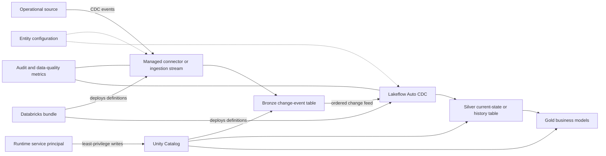

# CDC pipeline architecture scaffold

> **Status:** architecture-only roadmap. Nothing in this document is deployed, scheduled, or executed by the current bundle.

## Purpose

The next pipeline iteration will process only changed records after an initial load and propagate inserts, updates, and deletes through the medallion layers. The design keeps ingestion, CDC state application, business transformation, governance, and deployment as separate responsibilities.

## Recommended architecture



## Layer responsibilities

| Layer | Responsibility | Mutation model |
| --- | --- | --- |
| Source | Produces inserts, updates, and deletes with a stable key and ordering value | Source-owned |
| Bronze | Preserves the source change envelope and ingestion metadata without business transformation | Append-only event history |
| Silver | Applies ordered changes, deduplicates retries, and represents current state or SCD Type 2 history | Auto CDC-managed upserts and deletes |
| Gold | Produces business-facing facts, dimensions, and aggregates from governed Silver data | Recomputed or incrementally refreshed |
| Control | Defines enabled entities, keys, sequence columns, delete rules, target mode, and dependencies | Versioned configuration |
| Audit | Records run identifiers, source offsets, row counts, rejects, latency, and failures | Append-only operational history |

## Change contract

Every source feed must provide a stable business key, operation, deterministic sequence, event timestamp, ingestion timestamp, source traceability metadata, and record payload. If a timestamp is not unique, use a compound sequence such as source commit version plus row ordinal.

## Processing pattern

1. Perform an explicit, idempotent initial hydration.
2. Land subsequent change events unchanged in Bronze.
3. Validate keys, operations, and sequencing metadata; quarantine invalid events.
4. Apply valid events to Silver using Lakeflow Auto CDC.
5. Use SCD Type 1 for current state or SCD Type 2 where history is required.
6. Propagate deletes explicitly: delete a Type 1 row or close a Type 2 record.
7. Build Gold models from governed Silver state rather than raw events.
8. Persist metrics and the last successfully processed source position.

## Why Lakeflow Auto CDC

The preferred implementation is a serverless Lakeflow Spark Declarative Pipeline using Auto CDC. It provides managed handling for ordered inserts, updates, deletes, and SCD Type 1 or Type 2 targets, avoiding custom `foreachBatch` and `MERGE` state logic for the normal CDC path.

Delta Change Data Feed and Structured Streaming serve different purposes:

- Change Data Feed exposes row-level changes from a Delta source.
- Structured Streaming incrementally consumes those changes.
- Auto CDC applies the ordered changes to target state.

If the upstream boundary is already a Delta table, enable and consume CDF there. For a database or event system, use its supported connector or streaming interface and normalize its envelope in Bronze.

## Metadata-driven scaffold

Each entity should eventually have reviewed configuration similar to this conceptual contract:

```yaml
entities:
  customers:
    source: bronze.customer_changes
    target: silver.customers
    keys: [customer_id]
    sequence_by: [source_commit_version, source_row_ordinal]
    operation_column: operation
    delete_values: [DELETE]
    scd_type: 1
    enabled: true
```

This is architecture documentation, not an implemented configuration schema. Runtime metadata may select approved entities and parameters, but it must not create unreviewed jobs, tables, grants, or arbitrary transformation code.

## Ownership boundaries

| Component | Owner |
| --- | --- |
| Catalogs, schemas, grants, and runtime identities | Terraform |
| Pipeline definition, task configuration, and deployment targets | Databricks bundle |
| CDC parsing, validation, and table logic | Python or SQL package deployed by the bundle |
| CI checks, artifact creation, and environment promotion | GitHub Actions |
| Source authorization | Platform-managed secretless identity where supported |
| Business keys, SCD policy, retention, and quality rules | Data-product owner with platform review |

The deployment service principal deploys pipeline definitions. The runtime service principal executes them with only the Unity Catalog privileges required for approved sources and targets.

## Reliability and cost requirements

- Use durable, isolated state per flow and make replay idempotent.
- Handle duplicate, late, and out-of-order events explicitly.
- Retain source history long enough to recover before a CDF gap.
- Quarantine invalid events and record inserted, updated, deleted, rejected, and replayed counts.
- Use `dev` for synthetic data and `qual` for representative replay and deletion tests.
- Prefer triggered or available-now execution unless continuous latency justifies persistent compute cost.

## Acceptance scenarios

Before production, automated tests must prove insertion, Type 1 or Type 2 updates, deletion, idempotent replay, deterministic out-of-order handling, quarantine behavior, safe restart, safe schema-change failure, and least-privilege runtime access.
