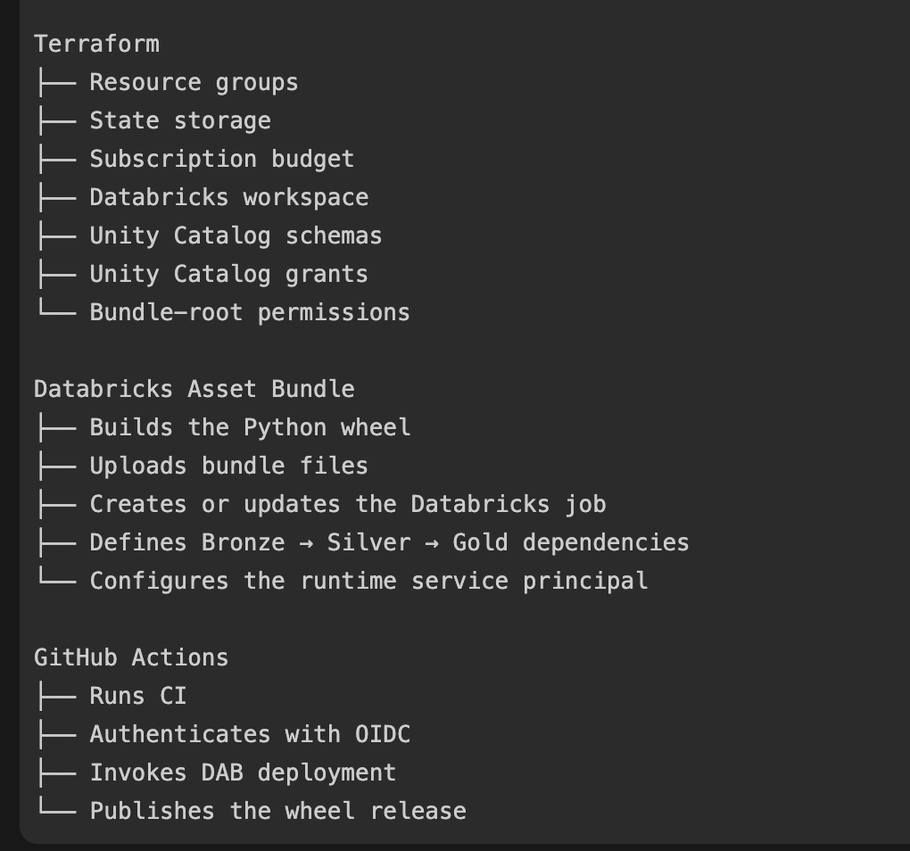

# Databricks deployment and identity runbook

This runbook records the configuration proven by the successful `dev` deployment on 2026-08-13. The repository deploys without Databricks PATs, OAuth client secrets, or passwords.

## What happens after a commit

```text
push to main
  -> CI builds the dev container and runs tests
  -> successful CI triggers the dev environment
  -> GitHub issues a short-lived OIDC token
  -> Databricks validates the federation policy
  -> sp-dbx-bundle-deployer-dev uploads the wheel and updates the job
  -> workflow ends without running the job
```

The workflow runs `databricks bundle deploy`, not `databricks bundle run`. Deployment updates definitions and files but does not start serverless compute.

`qual` and `prod` are manual workflow-dispatch targets and should require protected GitHub environment approval. Promote the same tested commit and artifact rather than rebuilding different code per environment.

See the [DAB multi-environment deployment guide](dab-multi-environment-notes.md) for target routing, compute configuration, environment isolation, and the remaining setup.



## Why the administration layers are separate

Azure and Databricks enforce different security boundaries:

| Role | Scope | What it controls | What it does not imply |
| --- | --- | --- | --- |
| Azure subscription Owner/Contributor | Azure subscription or resource group | Azure resources and RBAC | Entra directory or Databricks account administration |
| Microsoft Entra Global Administrator | Entra tenant | Directory-wide identity administration | Permanent Databricks workspace access |
| Databricks account admin | Databricks account | Account identities, workspaces, federation policies, and account settings | Automatic administration inside every workspace |
| Databricks workspace admin | One workspace | Workspace users, jobs, compute, and workspace ACLs | Account-level federation policy administration |
| Unity Catalog privileges | Catalog objects | Catalog, schema, table, and volume access | Azure or workspace administration |

Federation policies are account-level because they decide which external identity provider may impersonate a Databricks service principal across the Databricks account security boundary. A workspace admin can administer jobs in one workspace but cannot establish that account-wide trust.

### Why Microsoft Entra Global Administrator was temporarily required

A new Azure Databricks account has no initial Databricks account admin. Microsoft requires an Entra Global Administrator from the workspace tenant to perform the first Account Console login. That privileged login establishes the first Databricks account admin; it is a bootstrap control, not a normal deployment requirement.

For this sandbox we created:

```text
databricks-admin@sharmabinayaoutlook.onmicrosoft.com
```

The process was:

1. Create the dedicated cloud-only Entra user.
2. Temporarily assign Microsoft Entra `Global Administrator`.
3. Sign in at [Azure Databricks Account Console](https://accounts.azuredatabricks.net).
4. Confirm **User management** is available, proving Databricks account-admin bootstrap succeeded.
5. Configure the deployment service principal federation policy.
6. Remove the Entra Global Administrator assignment after verification; retain only the necessary Databricks account-admin role.
7. Enable MFA and do not use the privileged user for daily development or CI/CD.

Azure subscription ownership and Entra Global Administrator are different roles. Owning the subscription does not automatically allow directory-wide identity administration.

## Account Console versus workspace settings

Launching Databricks from the Azure Portal opens an individual workspace. A page with the breadcrumb **Workspace settings** and tabs such as **Secrets** or **Git integration** is not the Account Console and cannot create workload federation policies.

Use [https://accounts.azuredatabricks.net](https://accounts.azuredatabricks.net), then navigate to:

```text
User management
-> Service principals
-> sp-dbx-bundle-deployer-dev
-> Credentials & secrets
-> Federation policies
```

Do not configure workspace Git integration, a GitHub PAT, or a Databricks OAuth secret for this deployment flow.

## Identity separation

| Identity | Application or user ID | Responsibility |
| --- | --- | --- |
| Human workspace administrator | `sharma.binaya@outlook.com` | Bootstrap, review, and break-glass operations |
| Dedicated account administrator | `databricks-admin@sharmabinayaoutlook.onmicrosoft.com` | Databricks account administration |
| Deployment service principal | `feb13c34-eccb-4341-8ce4-0d4b5700157a` | GitHub bundle deployment and ownership of bundle-managed resources |
| Runtime service principal | `7598c51f-25f3-44fc-9b89-a1af87366465` | Job `run_as` identity and governed data access |

The deployer should manage job definitions without normal table-write privileges. The runtime identity should write only to the required Unity Catalog schemas and should not manage deployments.

In a company, every developer has a unique corporate identity. Human permissions normally come through groups such as:

```text
grp-databricks-data-engineers
grp-databricks-workspace-admins
grp-databricks-account-admins
```

Use MFA and Conditional Access for people, PIM for temporary privileged access where available, service principals for automation, and managed identities for Azure resource-to-resource access. Never share human accounts.

## GitHub environment configuration

Create `dev`, `qual`, and `prod` under **GitHub Settings -> Environments**. The verified `dev` variables are:

| Variable | Value |
| --- | --- |
| `DATABRICKS_HOST` | `https://adb-7405618741367416.16.azuredatabricks.net` |
| `DATABRICKS_CLIENT_ID` | `feb13c34-eccb-4341-8ce4-0d4b5700157a` |
| `DATABRICKS_RUNTIME_CLIENT_ID` | `7598c51f-25f3-44fc-9b89-a1af87366465` |
| `DATABRICKS_CATALOG` | `dbw_azref_sandbox_centralindia_001` |

These are identifiers and configuration, not credentials. They do not authenticate without a matching signed GitHub OIDC token.

The workflow also requires:

```yaml
permissions:
  contents: read
  id-token: write
```

Protect `main`, restrict repository write access, and require review for workflow changes. Anyone authorized to change a trusted workflow could request its OIDC token.

## Verified GitHub OIDC federation policy

The generic OIDC policy that matched the token issued in this repository is:

| Field | Verified value |
| --- | --- |
| Issuer | `https://token.actions.githubusercontent.com` |
| Subject claim | `sub` |
| Subject | `repo:binaya-sharma@79435710/az-deployment-w-terraform@1319107186:environment:dev` |
| Audience | `https://adb-7405618741367416.16.azuredatabricks.net/oidc/v1/token` |

The numeric organization and repository IDs make the trust resilient to renaming and prevent another repository from matching by reusing an old name. Configure separate exact policies and identities for `qual` and `prod` rather than broadening the `dev` policy.

Authentication is:

```text
GitHub signed OIDC token
  -> exact issuer + immutable subject + audience validation
  -> short-lived Databricks OAuth token
  -> deployment service principal
```

No Azure CLI login occurs in the GitHub bundle workflow. Future Terraform automation will require a separate GitHub-to-Microsoft-Entra OIDC trust for Azure Resource Manager; successful Databricks authentication grants no Azure permissions.

## One-time migration of the existing job to CI ownership

The job was initially deployed locally and owned by the human account. The first CI deployment could upload files but could not reconcile the existing job ACL. A workspace admin performed this one-time transfer:

```bash
DATABRICKS_HOST="https://adb-7405618741367416.16.azuredatabricks.net" \
DATABRICKS_AUTH_TYPE=azure-cli \
  databricks jobs update-permissions 365035251226465 --json '{
    "access_control_list": [
      {
        "service_principal_name": "feb13c34-eccb-4341-8ce4-0d4b5700157a",
        "permission_level": "IS_OWNER"
      },
      {
        "user_name": "sharma.binaya@outlook.com",
        "permission_level": "CAN_MANAGE"
      }
    ]
  }'
```

Result:

```text
sp-dbx-bundle-deployer-dev -> IS_OWNER
Binaya Sharma              -> CAN_MANAGE
admins group               -> inherited CAN_MANAGE
```

This is migration/bootstrap, not a command to run on every deployment. Jobs created initially by CI should already be owned by the deployment identity. Bundle-owned job permissions should subsequently be changed in source and redeployed.

## Deployment tools and commands

The GitHub runner installs pinned `uv` and Databricks CLI tooling. `uv` is required because the bundle artifact uses:

```yaml
artifacts:
  wheel:
    type: whl
    build: uv build --wheel
```

The deployment performs:

```bash
databricks bundle validate --strict --target dev
databricks bundle deploy --target dev
```

It uploads the wheel and bundle files, then reconciles the job definition. It does not execute the job.

## Automatic dev prereleases

After a successful automatic `dev` deployment, the same workflow publishes a GitHub prerelease. A release is never created when CI, authentication, bundle validation, or deployment fails.

For project base version `0.1.0`, a workflow run produces values such as:

```text
Python wheel version: 0.1.0.dev18
Git tag/release:      v0.1.0-dev.18
```

The release contains the exact wheel produced and deployed by that deployment job plus `SHA256SUMS`. The release job downloads the preserved artifact instead of rebuilding it. Rerunning the same workflow is idempotent: it reuses the same tag and replaces matching assets rather than creating a duplicate release.

Dev releases are marked as GitHub **prereleases** because automatic deployment to `dev` is not a production release decision. Stable SemVer tags such as `v0.1.0` will be added with the future protected `qual` and `prod` promotion process.

Least-privilege permissions remain separated:

```text
Databricks deploy job -> contents: read, id-token: write
GitHub release job    -> contents: write, no Databricks OIDC permission
```

## Troubleshooting history

| Error | Cause | Resolution |
| --- | --- | --- |
| Missing GitHub environment variable | `dev` environment variables were absent | Add the four identifier variables listed above |
| `TOKEN_SUBJECT_INVALID` | Policy subject/audience did not match the issued JWT | Use the exact immutable subject and workspace token audience above |
| `uv: command not found` | GitHub runner lacked the bundle artifact builder | Install pinned `uv` before validation and deployment |
| `only workspace admins can change the owner of a job` | Existing job was human-owned | One-time workspace-admin transfer to deployer `IS_OWNER` |
| Git credential or OAuth secret screen | Workspace Git integration was opened by mistake | Cancel; configure federation in the Account Console |
| Account picker references `Microsoft Services` | Personal identity was used against the wrong tenant | Use the tenant cloud identity and bootstrap the first account admin |

## Verified result and cleanup

Verified on 2026-08-13:

```text
CI quality gate: success
Deploy Databricks bundle: success (run 31686308640, attempt 2)
Target: dev
Job ID: 365035251226465
```

After verification:

1. Remove the temporary Microsoft Entra Global Administrator role from `databricks-admin`.
2. Revoke any unused OAuth secret created during troubleshooting.
3. Keep the cloud user only if it remains a required Databricks account administrator, and protect it with MFA.
4. Keep the job stopped unless an explicit smoke test is approved; deployment itself incurs no job-compute usage.
5. Configure required reviewers before enabling `qual` or `prod`.
