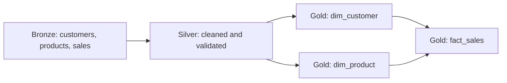

# Retail medallion smoke-test pipeline

This is a deliberately small adaptation of the `retail-analytics-spark` project. It verifies our packaging, Databricks bundle, serverless workflow, Unity Catalog governance, task dependencies, and write identity without copying local Spark state or deploying a production data platform.



## Deliberate limits

- Three small synthetic source tables are generated in SQL.
- Each layer uses `CREATE OR REPLACE TABLE`, making this a deterministic deployment smoke test rather than an incremental production ingestion design.
- The bundle defines no schedule or trigger.
- The job uses serverless task environments and stops after the Gold task.
- Deployment is blocked by the placeholder runtime service-principal application ID until governance is ready.

## Future TODO: metadata-driven pipeline

Keep the first smoke test static and easy to inspect. A later iteration can make entity processing metadata-driven:

- Define sources, targets, keys, load strategy, and dependencies in versioned YAML or a Unity Catalog control table.
- Use one generic ingestion/transformation entry point rather than one hardcoded implementation per entity.
- Resolve enabled entities and their source-to-target dependency graph at runtime.
- Use Databricks `for_each` tasks where parallel entity execution fits, with explicit Bronze, Silver, and Gold barriers.
- Record run ID, watermark, target table, row counts, status, and failure details in an audit table.
- Reject missing dependencies and dependency cycles before starting writes.
- Preserve the runtime service principal as the only normal writer.

The bundle should continue to own the stable job shell. Runtime metadata may select entities and transformations, but it must not create an unreviewed job definition or bypass Unity Catalog grants.

## Future TODO: CDC and Change Data Feed

The production pipeline should process only changes after its initial hydration and propagate source inserts, updates, and deletes to downstream targets.

Preferred design:

- Enable Delta Change Data Feed on source or preceding-layer tables that form CDC boundaries.
- Use serverless Lakeflow `AUTO CDC` for managed SCD Type 1 or Type 2 processing when its requirements fit; Databricks recommends it over the older `APPLY CHANGES` API.
- Define stable business keys and a deterministic, non-null sequencing column for every feed.
- Map delete events explicitly so a source delete deletes or expires the matching target record according to the table's SCD policy.
- Perform an idempotent initial hydration before consuming ongoing changes.
- Retain checkpoints and source history long enough to recover without crossing a vacuum or CDF-retention gap.
- Capture inserted, updated, deleted, rejected, and replayed row counts in an audit table.
- Test duplicates, out-of-order and late events, checkpoint restart, schema evolution, and checkpoint-loss recovery.

Alternative wheel-job design:

- Read CDF with Structured Streaming and `readChangeFeed=true`.
- Use a durable checkpoint per source-to-target flow.
- Process each micro-batch with `foreachBatch` and an idempotent Delta `MERGE` that handles inserts, update post-images, and deletes.
- Use available-now triggered execution for cost-controlled batch-style CDC unless latency requires a continuous stream.

CDF identifies changed rows; Structured Streaming is the engine that incrementally consumes them. They are complementary rather than competing approaches. Keep the current `CREATE OR REPLACE` smoke test unchanged until this CDC design is implemented and tested separately.

## Governance prerequisite

Terraform must first create catalog `retail_sandbox`, schemas `bronze`, `silver`, and `gold`, register the runtime service principal, and grant that principal `USE CATALOG`, `USE SCHEMA`, `SELECT`, `CREATE TABLE`, and `MODIFY` as appropriate. Human users should not receive normal write privileges.

## Safe workflow

Commands that do not run Databricks compute:

```bash
uv run pytest
databricks bundle validate --target sandbox
databricks bundle deploy --target sandbox
```

Deployment creates or updates the job definition but does not execute it. The following command starts serverless compute and can incur Databricks usage charges:

```bash
databricks bundle run --target sandbox retail_medallion_smoke_test
```

Do not run it until the governance stack, runtime identity, bundle summary, and expected cost have been reviewed.
