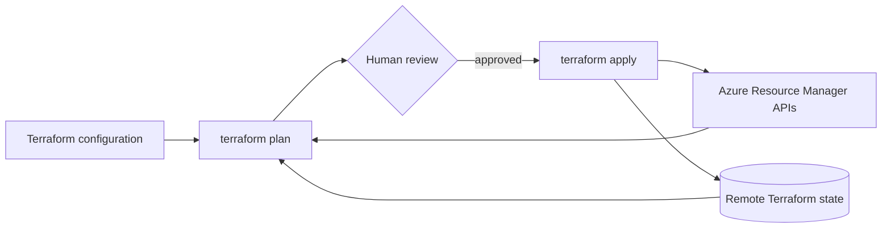
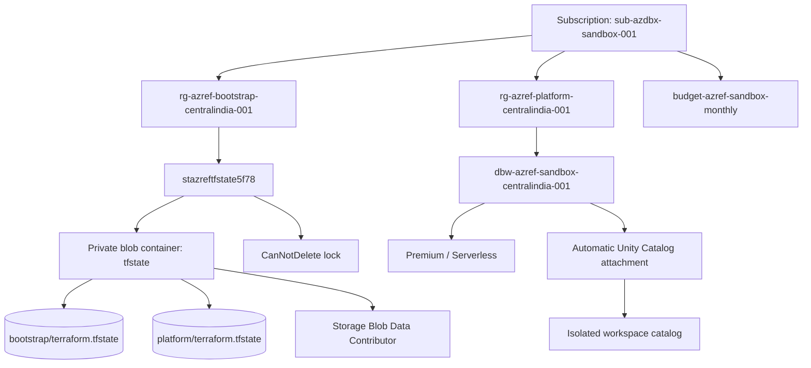
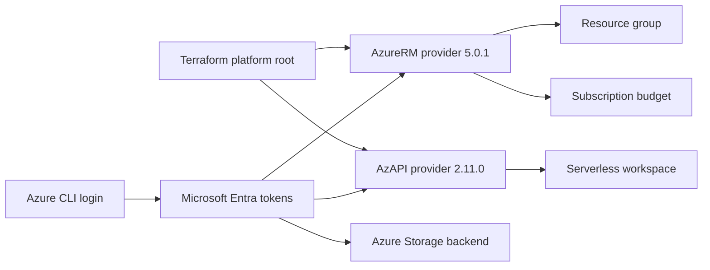
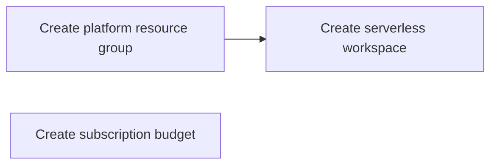

# Terraform and Azure architecture

This guide explains what Terraform does in this repository, what Azure receives, how state is protected, and where the current ownership boundary ends. It describes the deployed sandbox as of 2026-08-06.

## Terraform's role

Terraform is the infrastructure orchestrator. The `.tf` files declare the desired Azure configuration; Terraform compares that declaration with its state and the live Azure APIs, calculates a plan, and sends only approved create, update, or delete requests during an apply.

Terraform is not an Azure hosting service and does not run continuously. After `terraform apply` finishes, Azure operates the resources. Terraform runs again only when a person or CI workflow invokes it.



During planning, Terraform reads both remote state and Azure. During apply, it calls Azure and then records the resulting resource identifiers and attributes in state.

## Ownership boundary

The following hierarchy existed before the platform stack and is not created by this repository:

```text
Microsoft Entra tenant: bbc40903-74f4-495f-9185-08f2bf5b64be
└── Tenant Root Group
    └── Management group: AzureDatabricks
        └── Subscription: sub-azdbx-sandbox-001
            Subscription ID: 5f78f2e9-eaa7-4de4-bf8c-2ffb97c6b9b0
```

Tenant creation, billing setup, management-group creation, and creation of the first subscription remain manual organization-level operations. Terraform ownership starts inside the subscription.



The budget is subscription-scoped, so Azure does not place it inside the platform resource group.

## Why there are two Terraform roots

The repository separates bootstrap resources from platform resources because the remote backend must exist before other stacks can store state in it.

| Root module | Path | State key | Responsibility |
| --- | --- | --- | --- |
| Bootstrap | `infrastructure/bootstrap` | `bootstrap/terraform.tfstate` | Backend resource group, storage account, container, state access, and deletion lock |
| Platform | `infrastructure/stacks/platform` | `platform/terraform.tfstate` | Platform resource group, subscription budget, and serverless Databricks workspace |

This reduces blast radius. A platform change does not need to modify the storage account holding Terraform state, and each root has its own state lock and lifecycle.

### Bootstrap sequence

The backend creates a bootstrapping problem: Terraform cannot initially store state in storage that does not exist. The safe sequence is:

1. Initialize the bootstrap root with local state.
2. Apply it to create the Azure Storage backend.
3. Grant the current operator blob data access.
4. Add the backend configuration.
5. Reinitialize and migrate bootstrap state into Azure.
6. Initialize later roots directly against their own remote state keys.

That migration is complete. New checkouts initialize against the existing backend rather than repeating the local bootstrap apply.

## Bootstrap stack on Azure

### Resource group

`rg-azref-bootstrap-centralindia-001` groups resources whose purpose is Terraform state. It is separate from the platform so accidental deletion of the platform resource group cannot delete state.

### Storage account

`stazreftfstate5f78` is a Standard LRS `StorageV2` account. The configuration enforces:

- HTTPS-only access and TLS 1.2 or newer.
- Microsoft Entra authorization as the default.
- Shared-key authorization disabled.
- Local storage users disabled.
- Anonymous nested-item access disabled.
- Blob versioning enabled.
- Seven-day blob and container deletion retention.
- A `CanNotDelete` management lock.

The public Storage endpoint is enabled so the dev container and future hosted CI runners can reach it. Public reachability does not provide authorization: the caller still needs an Entra token and the appropriate blob data-plane role.

### Container, state, and locking

The private `tfstate` container holds separate state blobs:

```text
tfstate
├── bootstrap/terraform.tfstate
└── platform/terraform.tfstate
```

Each key is independent. During a state-changing command, the `azurerm` backend leases the relevant blob to prevent concurrent writers from corrupting it.

The operator has `Storage Blob Data Contributor` at container scope. Azure management-plane roles and storage data-plane roles are distinct: Subscription Contributor alone does not guarantee blob access through Entra authentication.

## Platform stack on Azure

The platform stack declares exactly three resources.

### Platform resource group

The reusable resource-group module creates `rg-azref-platform-centralindia-001` in `centralindia`. It applies these tags:

| Tag | Current value |
| --- | --- |
| `application` | `azref` |
| `environment` | `sandbox` |
| `owner` | `platform-owner` |
| `cost_center` | `learning` |
| `data_classification` | `internal` |
| `managed_by` | `terraform` |
| `purpose` | `azure-databricks-serverless` |

The module validates naming and tag rules before sending a request to Azure.

### Subscription budget

`budget-azref-sandbox-monthly` is attached to the subscription. Its amount is `10` in the subscription billing currency. It sends actual-spend notifications at:

- 50% (`5`)
- 80% (`8`)
- 100% (`10`)

A budget is monitoring and notification, not a hard spending cap. It does not automatically stop workloads or block deployments.

### Azure Databricks workspace

Terraform creates `dbw-azref-sandbox-centralindia-001` through:

```text
Microsoft.Databricks/workspaces@2026-01-01
```

The essential request is:

```hcl
properties = {
  computeMode = "Serverless"
}
sku = {
  name = "premium"
}
```

`computeMode` is immutable after creation. Explicitly setting `Serverless` prevents a Hybrid workspace from being created silently.

Azure reports:

- provisioning state `Succeeded`;
- Premium SKU and serverless-only compute;
- no Azure managed resource group;
- no customer-managed VNet, NAT Gateway, public IP, or VM;
- Databricks-managed default storage;
- automatic attachment to a regional Unity Catalog metastore.

AzureRM `5.0.1` does not expose the new workspace `computeMode`, so the Microsoft AzAPI provider manages this one resource. AzureRM manages the resource groups, backend resources, RBAC, lock, and budget.

## Provider and authentication architecture



Provider lock files record selected versions and checksums, making initialization reproducible within the declared constraints.

No Azure password is stored in the repository. Local providers use the active Azure CLI session. Future CI should use workload identity federation/OIDC and short-lived tokens.

## Dependency graph and creation order

Terraform builds a graph from references; it does not process files from top to bottom. This reference:

```hcl
parent_id = module.resource_group.id
```

makes the workspace depend on the resource group. Terraform creates the group first. The subscription budget has no dependency on it and can be created in parallel.



The applied plan contained `3 to add, 0 to change, 0 to destroy`. A subsequent plan returned `No changes`.

## Command lifecycle

### `terraform init`

Initialization reads `backend.hcl`, connects to Azure Storage using Entra authentication, selects the state key, downloads locked providers, and loads modules. It does not create platform resources.

### `terraform validate`

Validation checks Terraform syntax, provider schemas, types, and module wiring. It cannot prove Azure permissions, quotas, billing restrictions, or regional availability.

### `terraform plan`

Planning refreshes known resources from Azure and compares live Azure, state, and configuration. It proposes actions but does not normally change infrastructure. Review every replacement and destroy action.

### `terraform apply`

Applying a saved plan sends the approved operations to Azure. Terraform records confirmed IDs and attributes in remote state. A saved plan ensures the reviewed operations are applied when configuration, state, providers, platform, and credentials remain compatible.

## State is not the infrastructure

State maps Terraform addresses to Azure resource IDs. Deleting a state entry makes Terraform forget an object; it does not delete Azure. Deleting an Azure object manually does not update configuration; the next plan detects drift and may propose recreation.

State and plans may contain sensitive values. Never commit `.tfstate`, saved plans, `.terraform/`, credentials, or the real `terraform.tfvars`.

## File responsibilities

| File | Commit? | Purpose |
| --- | --- | --- |
| `variables.tf` | Yes | Input types, defaults, descriptions, and validation |
| `terraform.tfvars.example` | Yes | Safe template showing expected inputs |
| `terraform.tfvars` | No | Local subscription, tenant, and budget-contact values |
| `backend.hcl` | Yes | Non-secret remote-state location |
| `.terraform.lock.hcl` | Yes | Provider versions and integrity hashes |
| `*.tfplan` | No | Potentially sensitive, short-lived saved plans |

Tenant IDs, subscription IDs, resource IDs, and backend names are identifiers, not authentication secrets. Passwords, client secrets, tokens, storage keys, and SAS tokens must never be committed.

## Cost boundary

Terraform itself has no license charge in this workflow. Cost comes from Azure resources and consumption.

- Resource groups do not create compute charges.
- The budget is an alerting configuration.
- The serverless workspace has no customer-subscription VM, NAT Gateway, or public IP sitting idle.
- The backend stores small blobs and versions, so it can produce a tiny storage/transaction charge rather than being guaranteed to be exactly zero.
- Databricks charges can begin when notebooks, jobs, pipelines, SQL, model serving, or other metered workloads run.
- Default storage can become billable when data is written.

The `10` budget reduces surprise but does not enforce shutdown.

## Deliberately out of scope

Terraform does not yet create:

- the tenant, management group, subscription, or billing account;
- clusters, VMs, jobs, notebooks, pipelines, or SQL warehouses;
- VNet injection, subnets, NAT Gateway, firewall, or private endpoints;
- Access Connector, customer-owned ADLS, Key Vault, or Log Analytics;
- custom catalogs, schemas, grants, identities, or workspace settings;
- GitHub OIDC identities or deployment workflows.

- Azure Container Registry; dev-container images currently build locally or ephemerally in CI and are not pushed to a paid registry.

### Future ACR decision

Azure Container Registry remains in scope for a later phase when shared prebuilt dev-container images, controlled image promotion, vulnerability scanning, or faster CI builds justify it. Until then, local Docker builds and GitHub CI with `push: never` avoid registry storage and operation charges. Before enabling ACR, define image retention, immutable tags or digests, cleanup, RBAC/OIDC push access, and the monthly cost ceiling.

These are later design decisions with security, ownership, and cost consequences.

## Operational commands

```bash
az account show --output table

terraform -chdir=infrastructure/stacks/platform init -backend-config=backend.hcl
terraform -chdir=infrastructure/stacks/platform fmt -check
terraform -chdir=infrastructure/stacks/platform validate
terraform -chdir=infrastructure/stacks/platform plan
```

Apply only after reviewing a saved plan:

```bash
terraform -chdir=infrastructure/stacks/platform plan -out=platform.tfplan
terraform -chdir=infrastructure/stacks/platform show platform.tfplan
terraform -chdir=infrastructure/stacks/platform apply platform.tfplan
```

Do not use `-auto-approve` as a routine human workflow. Never run destroy, state removal, import, force-unlock, or manual Azure deletion without resolving the exact target and understanding recovery.

## Next boundary

The next design is Unity Catalog governance. First decide whether to retain the automatically created isolated workspace catalog or add separate `dev`, `qual`, and `prod` catalogs. That determines ownership, grants, storage, state separation, and eventual production isolation.

Terraform should own long-lived governance objects. Declarative Automation Bundles should later own deployable artifacts such as jobs and pipelines. The same object must never be owned by both systems.
